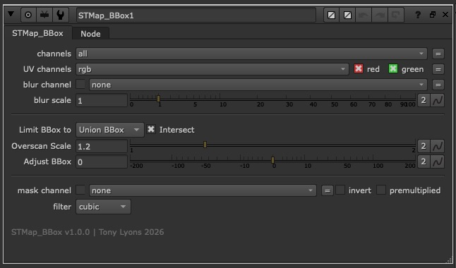

# STMap_BBox

Nuke NDK Plugin: An upgraded STMap node that helps limit the output BBox (bounding box) to the area of the warped content.
Replacement for stock `STMap` in workflows requiring further processing optimization.

Nuke's native STMap always defaults to the BBox of the STMap's `stmap` input, obliterating any smaller BBoxes and often making them full-format size.  STMap_BBox performs the same warp to the `src` input's BBox, so that whatever the image warps, the BBox only warps that amount as well.

Options for full control over BBox intersection, adjusting BBox padding, and "smart" BBox limiting to a percentage of the Format size (for those explosive BBox cases).

### How it works

To find the output box, STMap_BBox warps the `src` bounding box through the same UV map and takes the bounds of the result. It pushes the four corners *and* a series of points sampled along each edge through the warp, so the box captures outward bowing or warps between corners.

Great for LensDistortion maps. Could also be used for iTransform / Distortion / Warping workflows



---

This repository contains **compiled binaries only** (no source code). Licensed under [MIT](LICENSE).


## Supported platforms

| OS | Architecture | Nuke versions |
|----|--------------|---------------|
| macOS | arm64 (Apple Silicon) | 14.1, 15.0, 15.1, 15.2, 16.0, 16.1, 17.0 |
| Linux | x86_64 | 15.0, 15.1, 15.2, 16.0, 16.1, 17.0 |

Windows is not included in this release. Hoping to get some Windows support coming soon.

The `init.py` file inside of the `STMap_BBox` folder will fetch your OS and Nuke Major + Minor version and load the correct compiled Plugin for you.

If your Nuke major.minor version has no matching binary, the plugin prints a warning at startup and does not load.

## Install

1. Download and unzip `STMap_BBox_v1.2.0.zip` from [Releases](https://github.com/CreativeLyons/STMap_BBox-public/releases/latest).

2. Copy the `STMap_BBox` folder into your Nuke plugin path.  For example:

   Move or copy into your `~/.nuke/` folder

3. **Mac users only: run one command in Terminal**

   When you download files from the internet on a Mac, the system may block Nuke from opening the plugin. This is normal. The plugin is not broken.

   If you skip this step, Nuke may show a long error that includes: `library load disallowed by system policy`

   **How to fix it (do this once after you copy the folder):**

   1. Open **Terminal**.
   2. Copy the line below, paste it into Terminal, and press **Enter**:

      ```bash
      xattr -cr ~/.nuke/STMap_BBox
      ```

   3. If you put the `STMap_BBox` folder somewhere other than `~/.nuke/`, change the path in that line to match your folder.

   **Linux users:** skip this step.

4. Add this line to `~/.nuke/init.py` (create the file if missing):

   ```python
   nuke.pluginAddPath("./STMap_BBox")
   ```

   Alternatively, point to wherever on the server you placed the `STMap_BBox` folder:

   ```python
   nuke.pluginAddPath("/Replace/With/Path/To/Your/STMap_BBox")
   ```

5. Restart Nuke. Find the node under **Nodes → Transform → STMap_BBox**, or type `STMap_BBox` in the Tab search.

## Changelog

### [1.2.0] - 2026-06-25

#### Fixed

- The output bounding box no longer crops warped content under strong lens distortion, such as heavy anamorphic plates or large LensDistortion maps.
- Bounding-box accuracy is now consistent across all supported formats, from HD up to 8K.

## Bug reports

Please [open an issue](https://github.com/CreativeLyons/STMap_BBox-public/issues/new) on this repository. Include your OS, Nuke version, and steps to reproduce.
